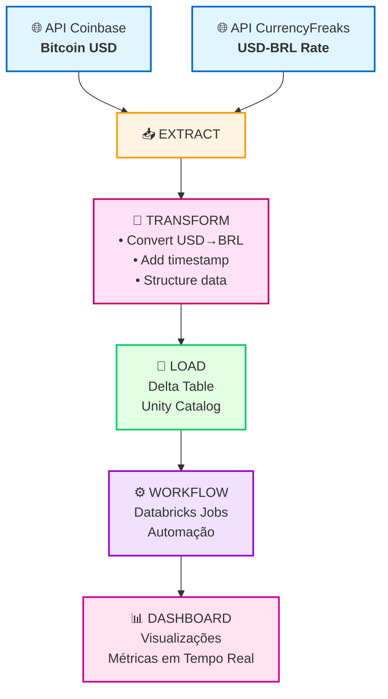

## 🎯 **Overview do Projeto**

### **Objetivo Principal**  

Desenvolver um pipeline ETL automatizado para consumir dados da **API da Coinbase** (informa preço de diversas criptomoedas em USD) e da **API CurrencyFreaks** (informa em tempo real cotação USD-BRL) e após transformar, armazenar em **Delta Tables** no Databricks usando **Unity Catalog**. Também cria um dashboard interativo para visualização.

1. **Extração de Dados**
   - Extrair preço atual do Bitcoin em USD da API Coinbase
   - Extrair cotação USD-BRL da API CurrencyFreaks
   - Tratamento de erros e retry logic

2. **Transformação de Dados**
   - Converter valor de USD para BRL usando cotação em tempo real
   - Adicionar timestamp de processamento
   - Estruturar dados em formato tabular

3. **Carga de Dados**
   - Armazenar dados em Delta Table no Unity Catalog
   - Suportar append incremental (histórico de preços)
   - Garantir schema evolution automático

4. **Automação**
   - Pipeline executável via Databricks Workflows
   - Configuração de parâmetros via Key-Value pairs
   - Execução agendada ou manual

---

### **Arquitetura Completa do Projeto**

### **Componentes do Projeto:**

1. **📥 EXTRACT**: Extração de dados de 2 APIs (Coinbase e CurrencyFreaks)
2. **🔄 TRANSFORM**: Conversão de moedas e estruturação de dados
3. **💾 LOAD**: Armazenamento em Delta Table no Unity Catalog
4. **⚙️ WORKFLOW**: Automação via Databricks Jobs & Pipelines
5. **📊 DASHBOARD**: Visualização interativa com métricas e gráficos

---
